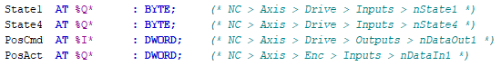

# TwinCAT Example using NC and Tria-Link

This TwinCAT 3 application example helps you getting started to use a *Triamec* drive with *Tria-Link* fieldbus.

## Prerequesites
The following prerequisites have to be met using this example code.
- A PC with a Tria-Link adapter (TL) installed.
- An installation of TwinCAT3 (3.1.4024 or newer).
- Triamec Tria-Link Library (TriamecLib 3.10.1.0 or newer)
- Drive commissioned
- All drives must be powered and connected to the Tria-Link adapter building a ring topology

## Tria-Link Adapter
Open the DPRAM settings for the Tria-Link adapter board in I/O > Devices > TriaLink > Generic NOV-DP-
RAM Device. The Vendor ID is 1618 and the Device ID is:
- *0200* for a TL100
- *0201* for a TLC201
- *0202* for a TLC100
- *0203* for a TL300 (PCIe)
- *0204* for a TLO100 (with USB Observer)
- *0205* for a TLO300 (PCIe, with USB Observer)
- *0206* for a TLOC100 (with USB Observer and additional controller)
- *0211* for a TL (formerly TLO400; PCIe with DMA and USB Observer)

Press **Search...** to find the Adapter on your System.

## Global Variable List (Triamec_GVL)
The following global variables have been defined to control and monitor the Tria-Link bus and axes.
| Variable | Description |
|---|---|
| gEnableTrialink | variable to enable Tria-Link |
| gEnableAxes | variable to enable all axes |
| gResetAxes | variable to reset all axes |
| gCommunicationReady | indicator for Tria-Link and axes readiness |

## NC Axis Function Block (TL_NCI_Axis)
The function block extends *TL_Axis2* available in the Triamec library by the NC specific interfaces.
Inputs and outputs (%I*, %Q*) are specified to link the axis function block and NC Axis. Ensure that these links are in place.

> [!NOTE]
> The example code makes use of the *Beckhoff* library *Tc2_CncHli*. Add it to the project.

## Test the example
- **Save** and **Rebuild** the Solution
- **Activate** the configuration and set TwinCAT to *Run Mode*
- **Login** and **Start** the PLC
- Open *Triamec_GVL* and set **gEnableTrialink** to **TRUE** and wait for **gCommunicationReady** getting **TRUE**
> [!NOTE]
> it can take up to 6s to boot the Tria-Link
- Enable the axes by setting **gEnableAxes** to **TRUE**
- If an error occurs, toggle **gResetAxes** an try to enable again
- 

