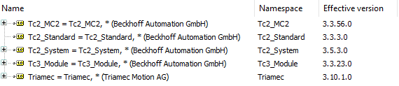
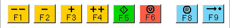

# TwinCAT Example using NC and Tria-Link

This TwinCAT 3 application example helps you getting started to use a *Triamec* drive with *Tria-Link* fieldbus.

> [!NOTE]
> Example tested with TwinCAT *v3.1.4024.50* and following libraries:

## Prerequisites

The following prerequisites have to be met using this example code.

- A PC with a *Tria-Link* adapter (TL) installed. The device driver is installed with the [TAM Software](https://www.triamec.com/en/tam-software-support.html) or from the *TriamecLib* package.
- An installation of TwinCAT3 (3.1.4024 or newer).
- *TriamecLib* 3.10.1.0 or newer installed. Available as download from [triamec.com](https://www.triamec.com/de/beckhoff-tam-integration-tria-link.html).
- Drive commissioned. Checkout the *Servo Drive Setup Guide* from the [documents](https://www.triamec.com/en/documents.html) page.
- This example targets a drive with `General/Parameters/LinkAddress = 10`. Set `General/Parameters/UseDedicatedLinkAddresses = True` to enforce the correct address.
- All drives must be powered and connected to the *Tria-Link* adapter, building a ring topology.

## Tria-Link Adapter

Open the DPRAM settings for the Tria-Link adapter board in **I/O > Devices > TriaLink > Generic NOV-DP-RAM Device**.
The Vendor ID is **1618** and the Device ID is **0211**.

Press **Search...** to find the Adapter on your System.

> [!NOTE]
> Make sure, that TwinCAT is in **Config Mode** before you search the *Tria-Link* Adapter.

## TwinCAT SYSTEM

Make sure to use an isolated core on the TwinCAT PC. As each PC is different, ensure to set up the **SYSTEM > Real-Time > Settings** accordingly. 

## Global Variable List (Triamec_GVL)

The following global variables have been defined to control and monitor the *Tria-Link* bus and axes.

| Variable              | Description                                |
| --------------------- | ------------------------------------------ |
| `gEnableTrialink`     | variable to enable Tria-Link               |
| `gEnableAxes`         | variable to enable all axes                |
| `gResetAxes`          | variable to reset all axes                 |
| `gCommunicationReady` | indicator for Tria-Link and axes readiness |

## NC Axis Function Block (NC_Axis)

The function block extends *TL_Axis2* available in the *TriamecLib* by the NC specific interfaces.
Inputs and outputs (%I*, %Q*) are specified to link the axis function block and NC Axis.
Ensure that these links are in place.

## Test the Example

- **Save** and **Rebuild** the Solution.
- **Activate** the configuration and set TwinCAT to *Run Mode*.
- **Login** and **Start** the PLC.
- Open *Triamec_GVL* and set **gEnableTrialink** to **TRUE** and wait for **gCommunicationReady** getting **TRUE**.

> [!NOTE]
> It can take up to 6s to boot the Tria-Link.

- Enable the axes by setting **gEnableAxes** to **TRUE**.
- If an error occurs, toggle **gResetAxes** an try to enable again.

### Ready to move the axes

You should now be able to control the axes over NC Axis GUI (Online GUI).
The buttons **-- F1**, **- F2**, **+ F3** and **++ F4** are in the **MOTION > NC-Task 1 SAF > Axes > Axis N > Online** dialog.

